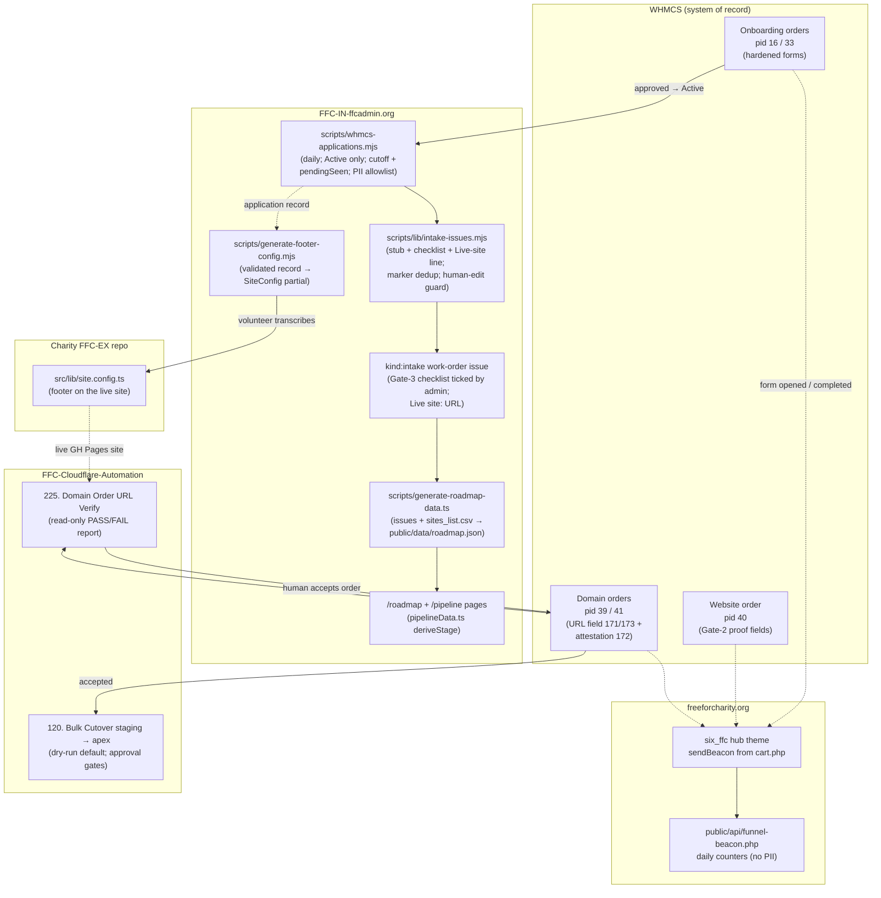

# Intake Automation Architecture

How the pieces of the gated charity journey fit together as a system: what holds the data, what
moves it, what renders it, and what guards it. The operator's step-by-step view is the
[gated-journey operator runbook](./gated-journey-operator-runbook.md); the policy definition is
[application-prerequisites-inventory.md](./application-prerequisites-inventory.md) Sections 4a/4b.

Three repos participate:

| Repo                           | Role                                                                               |
| ------------------------------ | ---------------------------------------------------------------------------------- |
| **FFC-IN-ffcadmin.org** (this) | Work-order issues, the sync + roadmap generators, the /roadmap and /pipeline pages |
| **FFC-Cloudflare-Automation**  | WHMCS/Cloudflare/M365 operational workflows (orders triage, URL verify, cutover)   |
| **FFC-IN-freeforcharity.org**  | Public journey copy, the WHMCS hub front door, the funnel beacon endpoint          |

---

## 1. Data flow

---

## 2. The pieces

### WHMCS — source of record

Every gate is a product order there: onboarding pids 16/33 (hardened with mandatory social-page
URLs, ToS certification, US attestation, and AI-usage dropdowns), website pid 40 (approved-
application reference + attestation), domain pids 39/41 (live GitHub Pages URL custom fields
171/173 + attestation field 172), email pids 42/43. WHMCS has no native cross-product
prerequisite, so each downstream form carries required proof fields an admin validates before
accepting. API access routes through the APIM gateway (static egress IP that WHMCS allow-lists).

### The sync — `scripts/whmcs-applications.mjs`

Runs daily from [`whmcs-intake.yml`](../.github/workflows/whmcs-intake.yml) (08:00 UTC), reads
WHMCS **read-only** (`GetClientsProducts` + `GetClientsDetails`), and turns approved applications
into work orders:

- **Statuses:** only **Active** services (approved) surface (`INTAKE_STATUSES`); **Pending** means
  "still under review" and never creates an issue.
- **Cutoff:** first-time issue creation requires the application date ≥ `INTAKE_SINCE` (default
  `2026-07-11`) — the flood guard against hundreds of historical Active services mass-creating
  issues.
- **pendingSeen:** ids observed Pending since the cutover are recorded in
  `automation/applications-sync-state.json`; when one later turns Active it bypasses the date
  cutoff, so apply-before/approve-after charities still get their work order.
- **PII allowlist:** only non-PII fields are derived (opaque id, org name, status, tier, mission
  tier/excerpt, Candid link, EIN, date). Emails, phones, addresses, and board members are never
  read into the record.
- Missing credentials or a WHMCS error is a **no-op**, leaving state unchanged.

A sibling, [`scripts/sync-applications.mjs`](../scripts/sync-applications.mjs), consumes a
published PII-safe feed instead of WHMCS directly (no-op until that feed exists); both share the
same issue plumbing so dedup, body, and labels stay identical.

### Work-order issues — `scripts/lib/intake-issues.mjs`

One `kind:intake` issue per approved application (label `status:needs-admin` at creation). The
stub body carries: a welcome preamble with the `ffc-application-id` dedup marker; structured intake
fields pre-filled from the application; the **Gate-3 validation checklist** (8 objective items,
Section 4b) as the last, volunteer-owned block; and the **`Live site:` line** whose placeholder
deliberately contains no `http(s)` URL. Existing issues are found by marker (survives state-file
loss) and their data fields refreshed daily — unless `hasHumanEdits()` detects a ticked box, a
filled `Live site:` URL, or any structural edit, after which the issue is human-owned.

### Roadmap data generator — `scripts/generate-roadmap-data.ts`

Builds `public/data/roadmap.json` (daily via `build-roadmap-data.yml`, plus intake-issue events)
from two sources: the live portfolio in `docs/sites_list.csv` ("Launched charities") and this
repo's `kind:intake` issues scored by the shared readiness engine. `liveUrlFrom()` extracts the
live URL **only** from an explicit `Live site:` marker; the most-advanced `status:*` label wins
when an issue carries several.

### /pipeline stages — `src/app/pipeline/pipelineData.ts`

Pure derivation from each roadmap entry onto the gates: `status:intake`/`needs-info` → **applied**;
`needs-admin`/`on-hold` → **approved**; `sponsored`/`active-build` → **building**; `status:live`
with a `github.io` URL → **validated**; `status:live` with a custom-domain URL (or `graduated`) →
**domain**; **email** is not derivable from the sync data yet. Unknown statuses bucket
conservatively as "applied" rather than crashing the static build. The
[/pipeline page](https://ffcadmin.org/pipeline/) groups every charity by derived stage so stalls
are visible at a glance.

### Footer bridge — application → `SiteConfig` partial → templates

[`scripts/generate-footer-config.mjs`](../scripts/generate-footer-config.mjs)
([footer-bridge.md](./footer-bridge.md)) is a pure transform from one PII-safe application record
to a `siteConfig` partial in the canonical shared shape
(FFC-IN-FFC_Single_Page_Template's `src/lib/site.config.ts`). It requires `charityName`, a valid
EIN, a Candid URL, and an explicit `501c3` stage — anything missing means **not validated**: it
exits non-zero listing every gap and never emits a partial footer. Output separates `siteConfig`
(what the application proves), `manualFields` (what a volunteer must gather), and `source`
(provenance). Today a volunteer **transcribes** the partial into the charity repo; no template
imports the JSON directly yet (future work, with Footer_Only_Template's adoption of the shared
shape under
[FreeForCharity/FFC-Cloudflare-Automation#693](https://github.com/FreeForCharity/FFC-Cloudflare-Automation/issues/693)).

### Domain-order URL verify — FFC-Cloudflare-Automation workflow 225

`225-whmcs-domain-order-url-verify.yml` + `scripts/whmcs-domain-order-url-verify.ps1`: scheduled
read-only sweep of Pending pid 39/41 orders under `whmcs-prod-read`. Per order it pulls the "Live
GitHub Pages URL of your validated website" field (ids 171/173) and verifies liveness — host must
be `*.github.io`, HTTP GET must return 200 — for a PASS/FAIL verdict, plus a WARN-only
footer-marker column. It never accepts, cancels, or annotates an order (WHMCS exposes no
order-annotation API); failures surface via the job summary and CSV artifact for a human. The
Gate-3 checklist and attestation field 172 are not machine-read yet (future work).

### Funnel beacon — freeforcharity.org

The WHMCS hub's `six_ffc` theme (managed over FTPS on the server, not in the repo) fires a
`navigator.sendBeacon()` from `cart.php` pages — `?s=view&p=<pid>` when an order form opens,
`?s=complete` on the order-complete page — with no cookies or identifiers.
[`public/api/funnel-beacon.php`](https://github.com/FreeForCharity/FFC-IN-freeforcharity.org/blob/main/public/api/funnel-beacon.php)
increments a daily `date → pid → step → count` counter in `~/ffc_funnel_counts.json`, **outside
the web root**. This measures the "filter rate" of the deliberately hard intake forms per product
(16/33 onboarding, 40 website, 39/41 domain, 42/43 email). WHMCS order reports stay authoritative
for submissions; beacons undercount (ad blockers), so read trends, not absolutes. See
[funnel-beacon.md](https://github.com/FreeForCharity/FFC-IN-freeforcharity.org/blob/main/docs/funnel-beacon.md).

### Banned-phrase guards

Two permanent CI tests keep old journey-order copy from creeping back:

- **This repo:** `__tests__/banned-phrases.test.ts` scans `src/`, `docs/`, and
  `.github/ISSUE_TEMPLATE/` (whitespace-normalized so JSX line breaks can't hide a phrase).
- **FFC-IN-freeforcharity.org:** `__tests__/content/banned-phrases.test.ts` scans its `src/`.

Both fail with file:line locations and a per-phrase reason. The banned set asserts the OLD
domain-first order — for example, copy claiming the domain is provisioned before the website
exists, or copy pointing applicants at a publicly posted discount code. Each phrase contradicts
the gated order or the coupon-in-email-only rule. (The phrases are deliberately not quoted here —
this file is inside the guard's scan roots; see the test files for the exact patterns.)

---

## 3. Failure modes & guards

| Guard                                     | Where                                          | What it catches                                                                                                   |
| ----------------------------------------- | ---------------------------------------------- | ----------------------------------------------------------------------------------------------------------------- |
| Status gating (`Active` only)             | `whmcs-applications.mjs`                       | A still-under-review (Pending) or Cancelled/Fraud application getting a work order                                |
| Flood-guard cutoff (`INTAKE_SINCE`)       | `whmcs-applications.mjs` / `intake-issues.mjs` | Hundreds of historical Active services mass-creating issues; dateless records also fail closed                    |
| `pendingSeen` tracking                    | sync state file                                | A charity that applied pre-cutoff but was approved post-cutoff being silently skipped                             |
| PII allowlist                             | `whmcs-applications.mjs`                       | Personal contact data (emails, phones, addresses, board members) leaking into public issues                       |
| Marker-based dedup (`ffc-application-id`) | `intake-issues.mjs`                            | Duplicate work orders after a state-file loss — existing issues are found by marker, not state                    |
| Human-edit detector (`hasHumanEdits`)     | `intake-issues.mjs`                            | The daily refresh clobbering ticked checklist boxes, a recorded `Live site:` URL, or any manual edit              |
| URL-less `Live site:` placeholder         | stub body / `liveUrlFrom()`                    | The pipeline "validated" stage lighting up before a real GitHub Pages URL exists                                  |
| Unknown-status fallback                   | `pipelineData.ts`                              | A newly introduced `status:*` label crashing the static build — unknowns bucket as "applied"                      |
| Fail-closed footer generation             | `generate-footer-config.mjs`                   | A partial or unvalidated footer shipping — missing/invalid fields exit non-zero with the gap list                 |
| Read-only URL verify (workflow 225)       | FFC-Cloudflare-Automation                      | A dead or non-GitHub-Pages URL slipping past domain-order review; the report itself can never mutate an order     |
| No-op / illegal-transition refusal        | `whmcs-order-update.ps1`                       | Accepting a non-Pending order or double-cancelling; no bulk accept/cancel loop exists at all                      |
| Dry-run defaults + approval environments  | CMA workflows (e.g. 120, 211)                  | Accidental live DNS/order writes — live runs need `dry_run=false` plus a required reviewer's environment approval |
| Serialized cutover                        | workflow 120                                   | Parallel cutovers racing on the same FFC-EX CNAMEs / Cloudflare DNS                                               |
| Banned-phrase tests                       | both site repos' CI                            | Old domain-first journey copy (or public coupon-code copy) re-entering user-facing content                        |
| No-PII beacon design                      | `funnel-beacon.php`                            | The funnel metrics ever needing a consent banner — nothing user-identifying is stored, counters live off web root |

---

## 4. Future work (not yet wired)

- **Gate-3 auto-validation workflow** (`gate3-validate.yml`) — automated checking of the work-order
  checklist; in progress, not on `main`.
- **Direct template consumption** of the footer-bridge JSON (removes the transcription step); plus
  auto-PRing the generated values into the charity repo.
- **Email-stage signal** — extend the sync to surface an email-product-Active flag so /pipeline can
  derive its Email column.
- **Machine-reading the Gate-4 attestation field (172) and the Gate-3 checklist** in workflow 225,
  and pushing failure notes back onto WHMCS orders once a safe annotation path exists.
- **Published applications feed** — `sync-applications.mjs` stays a no-op until
  FFC-Cloudflare-Automation publishes the PII-safe feed.
